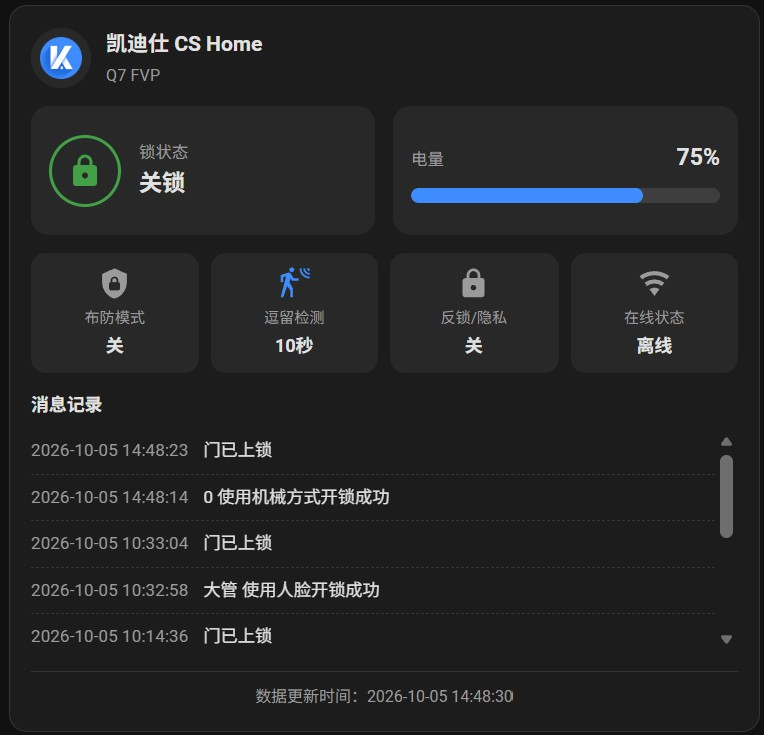

# 凯迪仕智能门锁 (Kaadas) Home Assistant 集成

基于凯迪仕微信小程序云端接口的 Home Assistant 集成。



## 功能

- **锁状态**：开锁 / 关锁（远程开锁暂未实现）

- **状态传感器**：电量、WiFi 信号、固件版本、物模型版本、锁状态、开门方向、自动上锁时间、音量、语言等

- **状态开关**：布防模式、反锁/隐私、双重验证、屏幕、在线状态

- **云端 WebSocket 实时推送**：开关锁 / 上下线 / 门铃等事件即时刷新（替代定时轮询）

- **消息记录**：最近操作（操作人 + 操作内容）、近 7 天开锁/门铃/报警统计

- **token 自动续期**：openId + 手机号自动重登录换新 token

- **凭证失效自动重新认证**：openId 失效时自动弹出重新认证表单

- **自带 Lovelace 卡片**：`kaadas-lock-card`

## 安装

### 方法一：HACS

1. HACS → 集成 → 右上角「…」→「自定义存储库」

2. 填入仓库地址 `https://github.com/shawjiniu/kaadas-ha`，类别选「集成」

3. 找到「凯迪仕智能门锁」并安装，重启 Home Assistant

### 方法二：手动安装

1. 将 `custom_components/kaadas/` 复制到 Home Assistant 的 `config/custom_components/` 目录

2. 重启 Home Assistant

3. 在「设置 → 设备与服务 → 添加集成」搜索「凯迪仕智能门锁」

## 配置

首次配置需填写小程序凭证（微信开发者工具 / 抓包获取）：

- `openid`：存储键 `openid`

- `phone`：手机号（11 位）

- `openIdToken`：存储键 `login_token`

集成会自动登录换取 token/uid，并自动续期。

## 仪表盘卡片

集成自带 `kaadas-lock-card` 卡片，**文件会自动同步到 `config/www/`**（无需手动复制）。

- **浏览器**：自动加载，无需任何操作。
- **手机 App**：需**添加一次资源**（只需做一次，之后更新集成会自动覆盖文件）：

  | 字段 | 值 |
  |---|---|
  | URL | `/local/kaadas-lock-card.js` |
  | 类型 | JavaScript 模块 |

  在「设置 → 仪表盘 → 资源」点「添加资源」填入上表即可。

之后在仪表盘添加卡片时搜索「凯迪仕门锁卡片」，或：

```yaml
type: custom:kaadas-lock-card
entity: lock.kaidas_xxx
```

> 本集成仅开发者个人使用，未经充分测试
